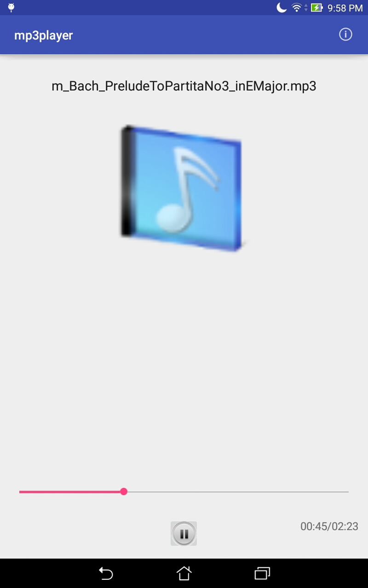
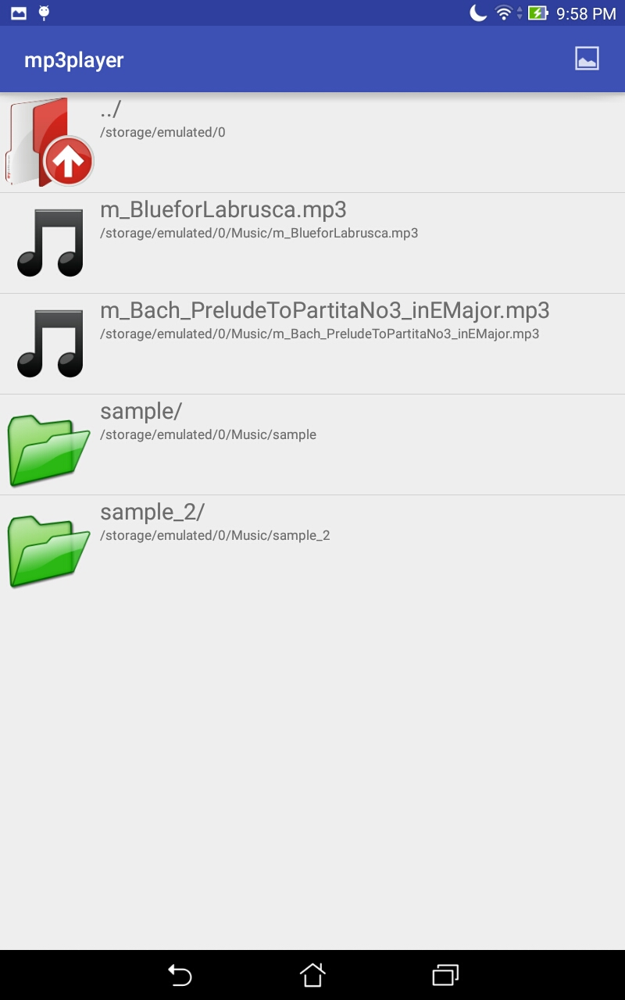

# AndroidMP3Player # 
## author: Jerry Guan

----------------------------------------------------------------------

### ThreadTesting Branch

Try to create a new thread to hold a MediaPlayer object,
basic on the test, MediaPlayer object has it own thread
when MediaPlayer is in Start state ```.start()```.

I try MediaPlayer run on UI thread, and user ```Thread.sleep()```
to block the UI thread, but the MediaPlayer still play music.
It seem I could conclude that MediaPlayer run on it own thread
Or MediaPlayer has higher priority that handling UI event.

Read from the source code of MediaPlayer,it get a looper.
As my understand, if the thread created it and has a looper,
MediaPlayer object will use it, if doesn't have, use the mainLooper

Then the MediaPlayer can run in a new thread or UI thread.

----------------------------------------------------------------------
### version 0.0.4
implemented appwidget via broadcast. 
Existing bugs on appwidget communicating with service




----------------------------------------------------------------------
### version 0.0.3 
fix some miner bugs, and add comment to files. 
user can click the icon on the up right 
for switching between music controller screen and music files folders screen

next version will try to implement appwidget so that user can control music on home screen,
implement music looping rather music stop after finish.
and update screen views

---------------------------------------------------------------------
I should create a Fragment for holding the configuration state
by calling ```setRetainInstance(true)```; then service can stay alive 

----------------------------------------------------------------------
### version 0.0.2
try to put every controlling view to a Fragment,
let Activity as a container to hold the Fragment

It should use ```FragmentManager.findFragmentById()``` 
rather than call ```new Fragment()```

next version will try multiple Fragments
so that user can slide the Fragments

----------------------------------------------------------------------

### version 0.0.1:
trying to implement a Service,
basic on google guide, I should new a thread for handle the Service
to prevent ANR (Application Not Responding).

The guide suggest me to use IntentService rather than Service
for avoiding ANR.

next version may create another Activity for start a Service,
then the exist Activity bind to the Service

----------------------------------------------------------------------

### version 0.0.0:
a media player only using one Activity and Media classes
next version will try to implement a Service 
so that music can play on background

#### main idea: 

1. Media object get the mp3 stream from internet and prepare for play
2. Button object setup event listener for control music play and pause
3. Handler object update the progress bar by implement Runnable object
